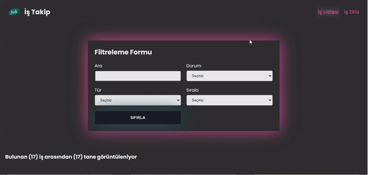

<h1>Jop App</h1>

- İş takip uygulaması
- İş eklenebilir ve silinebilir
- İşler arasında arama ve filtleme yapılabilir
- Kolay kullanım imkanı saglayan arayüze ve responsive bir yapıya sahiptir

<h2>Kullanılan Kütüphaneler</h2>

- Sayfalama için (react-router-dom)
- Veritabanı (json-server)
- Veri Çekme (axios)
- Sitillendirme (sass)
- State yönetimi (react-redux & @reduxjs/toolkit)
- Bildirimler (react-toastify)
- id (uuid)

<h2>Ekran Alıntısı</h2>

